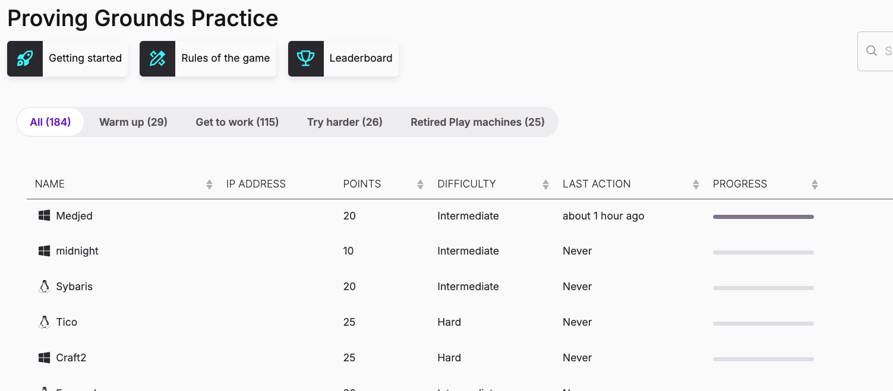

# sa1

## Port Scanning

```bash
# rustscan_TCP
sudo $(which rustscan) -a 192.168.217.127 -- -A -oN nmap.txt
```

```bash
PORT      STATE SERVICE       REASON          VERSION
135/tcp   open  msrpc         syn-ack ttl 125 Microsoft Windows RPC
139/tcp   open  netbios-ssn   syn-ack ttl 125 Microsoft Windows netbios-ssn
445/tcp   open  microsoft-ds? syn-ack ttl 125
3306/tcp  open  mysql?        syn-ack ttl 125
| mysql-info: 
|_  MySQL Error: Host '192.168.45.223' is not allowed to connect to this MariaDB server
| fingerprint-strings: 
|   FourOhFourRequest, LPDString, NULL, TerminalServerCookie: 
|_    Host '192.168.45.223' is not allowed to connect to this MariaDB server
5040/tcp  open  unknown       syn-ack ttl 125
8000/tcp  open  http-alt      syn-ack ttl 125 BarracudaServer.com (Windows)
|_http-server-header: BarracudaServer.com (Windows)
| http-webdav-scan: 
|   Server Date: Thu, 27 Feb 2025 16:06:56 GMT
|   Server Type: BarracudaServer.com (Windows)
|   WebDAV type: Unknown
|_  Allowed Methods: OPTIONS, GET, HEAD, PROPFIND, PUT, COPY, DELETE, MOVE, MKCOL, PROPFIND, PROPPATCH, LOCK, UNLOCK
| http-methods: 
|_  Supported Methods: GET POST
| http-open-proxy: Potentially OPEN proxy.
|_Methods supported:CONNECTION
| fingerprint-strings: 
|   FourOhFourRequest: 
|     HTTP/1.1 200 OK
|     Date: Thu, 27 Feb 2025 16:04:13 GMT
|     Server: BarracudaServer.com (Windows)
|     Connection: Close
|   GenericLines: 
|     HTTP/1.1 200 OK
|     Date: Thu, 27 Feb 2025 16:04:07 GMT
|     Server: BarracudaServer.com (Windows)
|     Connection: Close
|   GetRequest: 
|     HTTP/1.1 200 OK
|     Date: Thu, 27 Feb 2025 16:04:08 GMT
|     Server: BarracudaServer.com (Windows)
|     Connection: Close
|   HTTPOptions: 
|     HTTP/1.1 200 OK
|     Date: Thu, 27 Feb 2025 16:04:20 GMT
|     Server: BarracudaServer.com (Windows)
|     Connection: Close
|   RTSPRequest: 
|     HTTP/1.1 200 OK
|     Date: Thu, 27 Feb 2025 16:04:21 GMT
|     Server: BarracudaServer.com (Windows)
|     Connection: Close
|   SIPOptions: 
|     HTTP/1.1 400 Bad Request
|     Date: Thu, 27 Feb 2025 16:05:29 GMT
|     Server: BarracudaServer.com (Windows)
|     Connection: Close
|     Content-Type: text/html
|     Cache-Control: no-store, no-cache, must-revalidate, max-age=0
|     <html><body><h1>400 Bad Request</h1>Can't parse request<p>BarracudaServer.com (Windows)</p></body></html>
|   Socks5: 
|     HTTP/1.1 200 OK
|     Date: Thu, 27 Feb 2025 16:04:15 GMT
|     Server: BarracudaServer.com (Windows)
|_    Connection: Close
|_http-title: Home
|_http-favicon: Unknown favicon MD5: FDF624762222B41E2767954032B6F1FF
30021/tcp open  ftp           syn-ack ttl 125 FileZilla ftpd 0.9.41 beta
| ftp-anon: Anonymous FTP login allowed (FTP code 230)
| -r--r--r-- 1 ftp ftp            536 Nov 03  2020 .gitignore
| drwxr-xr-x 1 ftp ftp              0 Nov 03  2020 app
| drwxr-xr-x 1 ftp ftp              0 Nov 03  2020 bin
| drwxr-xr-x 1 ftp ftp              0 Nov 03  2020 config
| -r--r--r-- 1 ftp ftp            130 Nov 03  2020 config.ru
| drwxr-xr-x 1 ftp ftp              0 Nov 03  2020 db
| -r--r--r-- 1 ftp ftp           1750 Nov 03  2020 Gemfile
| drwxr-xr-x 1 ftp ftp              0 Nov 03  2020 lib
| drwxr-xr-x 1 ftp ftp              0 Nov 03  2020 log
| -r--r--r-- 1 ftp ftp             66 Nov 03  2020 package.json
| drwxr-xr-x 1 ftp ftp              0 Nov 03  2020 public
| -r--r--r-- 1 ftp ftp            227 Nov 03  2020 Rakefile
| -r--r--r-- 1 ftp ftp            374 Nov 03  2020 README.md
| drwxr-xr-x 1 ftp ftp              0 Nov 03  2020 test
| drwxr-xr-x 1 ftp ftp              0 Nov 03  2020 tmp
|_drwxr-xr-x 1 ftp ftp              0 Nov 03  2020 vendor
| ftp-syst: 
|_  SYST: UNIX emulated by FileZilla
|_ftp-bounce: bounce working!
33033/tcp open  unknown       syn-ack ttl 125
| fingerprint-strings: 
|   GenericLines: 
|     HTTP/1.1 400 Bad Request
|   GetRequest, HTTPOptions: 
|     HTTP/1.0 403 Forbidden
|     Content-Type: text/html; charset=UTF-8
|     Content-Length: 3102
|     <!DOCTYPE html>
|     <html lang="en">
|     <head>
|     <meta charset="utf-8" />
|     <title>Action Controller: Exception caught</title>
|     <style>
|     body {
|     background-color: #FAFAFA;
|     color: #333;
|     margin: 0px;
|     body, p, ol, ul, td {
|     font-family: helvetica, verdana, arial, sans-serif;
|     font-size: 13px;
|     line-height: 18px;
|     font-size: 11px;
|     white-space: pre-wrap;
|     pre.box {
|     border: 1px solid #EEE;
|     padding: 10px;
|     margin: 0px;
|     width: 958px;
|     header {
|     color: #F0F0F0;
|     background: #C52F24;
|     padding: 0.5em 1.5em;
|     margin: 0.2em 0;
|     line-height: 1.1em;
|     font-size: 2em;
|     color: #C52F24;
|     line-height: 25px;
|     .details {
|_    bord
44330/tcp open  ssl/unknown   syn-ack ttl 125
|_ssl-date: 2025-02-27T16:00:30+00:00; 0s from scanner time.
| fingerprint-strings: 
|   GetRequest: 
|     HTTP/1.1 200 OK
|     Date: Thu, 27 Feb 2025 15:56:46 GMT
|     Server: BarracudaServer.com (Windows)
|_    Connection: Close
| ssl-cert: Subject: commonName=server demo 1024 bits/organizationName=Real Time Logic/stateOrProvinceName=CA/countryName=US/organizationalUnitName=SharkSSL/emailAddress=ginfo@realtimelogic.com/localityName=Laguna Niguel
| Issuer: commonName=demo CA/organizationName=Real Time Logic/stateOrProvinceName=CA/countryName=US/organizationalUnitName=SharkSSL/emailAddress=ginfo@realtimelogic.com/localityName=Laguna Niguel
| Public Key type: rsa
| Public Key bits: 1024
| Signature Algorithm: md5WithRSAEncryption
| Not valid before: 2009-08-27T14:40:47
| Not valid after:  2019-08-25T14:40:47
| MD5:   3dd3:7bf7:464d:a77b:6d04:f44c:154b:7563
| SHA-1: 3dc2:5fc6:a16f:1c51:8eee:45ce:80cf:b35e:7f92:ebbe
45332/tcp open  http          syn-ack ttl 125 Apache httpd 2.4.46 ((Win64) OpenSSL/1.1.1g PHP/7.3.23)
|_http-title: Quiz App
| http-methods: 
|   Supported Methods: HEAD GET POST OPTIONS TRACE
|_  Potentially risky methods: TRACE
|_http-server-header: Apache/2.4.46 (Win64) OpenSSL/1.1.1g PHP/7.3.23
45443/tcp open  http          syn-ack ttl 125 Apache httpd 2.4.46 ((Win64) OpenSSL/1.1.1g PHP/7.3.23)
| http-methods: 
|   Supported Methods: HEAD GET POST OPTIONS TRACE
|_  Potentially risky methods: TRACE
|_http-title: Quiz App
49664/tcp open  unknown       syn-ack ttl 125
49665/tcp open  msrpc         syn-ack ttl 125 Microsoft Windows RPC
49666/tcp open  unknown       syn-ack ttl 125
49667/tcp open  unknown       syn-ack ttl 125
49668/tcp open  unknown       syn-ack ttl 125
49669/tcp open  msrpc         syn-ack ttl 125 Microsoft Windows RPC
```

## Service Enumeration

### 8000_HTTP/44330_HTTPS

